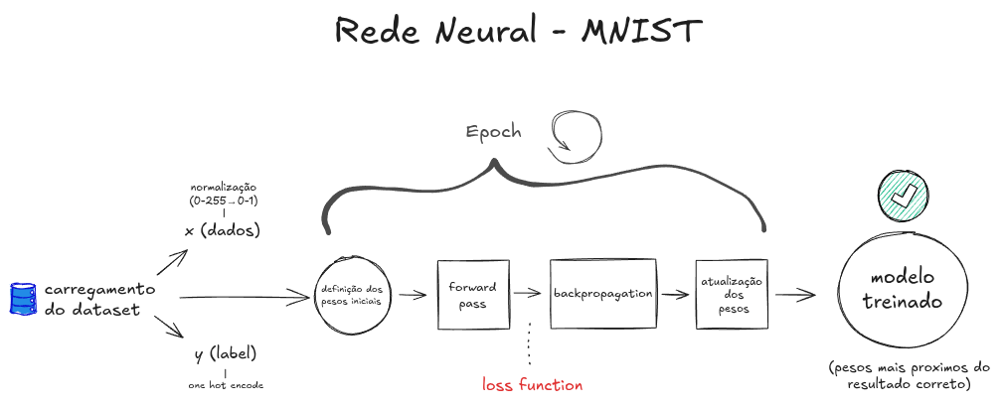

# MNIST Handwritten Digit Recognition Neural Network

This document provides a comprehensive overview of the custom-built neural network for recognizing handwritten digits from the MNIST dataset. It details the training process, including mathematical operations and their rationale, and instructions on how to train and test the model.

## Neural Network Training Process

The training process involves several key stages, from data loading and preprocessing to the iterative refinement of the neural network's parameters.

### 1. Data Loading

The MNIST dataset, a collection of 70,000 images (28x28 pixels) of handwritten digits (0-9), is loaded using the `fetch_openml` function from `sklearn.datasets`.

```python
from sklearn.datasets import fetch_openml
mnist = fetch_openml('mnist_784', version=1, as_frame=False, parser='auto') # Added as_frame and parser for future compatibility
X_data, y_data = mnist["data"], mnist["target"]
```
*Note: `X_data` contains 70,000 images, and `y_data` contains their corresponding labels.*

### 2. Data Preprocessing

Before being fed into the neural network, the data undergoes several transformations:

#### a. Normalization
Pixel values, originally ranging from 0 (black) to 255 (white), are scaled to a 0-1 range by dividing by 255.0. This normalization aids in faster and more stable training.

```python
X_normalized = X_data / 255.0
```

#### b. Data Transposition
The data matrix `X_normalized` is transposed from `[samples, features]` to `[features, samples]`. For MNIST, this changes the shape from `[70000, 784]` to `[784, 70000]`. This layout is often preferred for matrix operations in neural network implementations.

```python
X = X_normalized.T
```

#### c. One-Hot Encoding of Labels
The numerical labels `y_data` (e.g., 3, 7, 1) are converted into a one-hot encoded format. For instance, '3' becomes `[0,0,0,1,0,0,0,0,0,0]`. This is necessary for multi-class classification where the output layer uses Softmax. The labels are also transposed to `[num_classes, num_samples]`.

```python
y_integers = y_data.astype(int)
Y_one_hot = np.zeros((y_integers.size, y_integers.max() + 1))
Y_one_hot[np.arange(y_integers.size), y_integers] = 1
Y_one_hot = Y_one_hot.T
```

### 3. Neural Network Architecture

The neural network is a feedforward network with an input layer, one hidden layer, and an output layer.

#### a. Input Layer
- **Units:** 784
- **Description:** Each unit corresponds to one of the 784 pixels from a 28x28 MNIST image.

#### b. Hidden Layer
- **Neurons:** 128
- **Activation Function:** ReLU (Rectified Linear Unit)
    - **Formula:** `A = max(0, Z)`
    - **Explanation:** ReLU introduces non-linearity, allowing the network to learn complex patterns. It outputs the input directly if positive, and zero otherwise.

#### c. Output Layer
- **Neurons:** 10 (one for each digit class, 0-9)
- **Activation Function:** Softmax
    - **Explanation:** Softmax converts the raw output scores (logits) from the neurons into a probability distribution across the 10 classes. The sum of these probabilities is 1.
    - **Formula:** For an output vector `Z_out`, the probability for class `j` is `P(class_j) = e^(Z_out_j) / Σ(e^(Z_out_i))` for all classes `i`.

### 4. Weights Initialization

Weights and biases are the parameters the neural network learns during training.
- **Weights (W1, W2):** `W1` (hidden layer) and `W2` (output layer) are initialized with small random numbers (scaled by 0.01). This helps prevent neurons from learning identical features.
    - `W1` shape: `(128, 784)` (hidden_neurons, input_features)
    - `W2` shape: `(10, 128)` (output_neurons, hidden_neurons)
- **Biases (b1, b2):** `b1` (hidden layer) and `b2` (output layer) are initialized to zero.
    - `b1` shape: `(128, 1)`
    - `b2` shape: `(10, 1)`

```python
W1 = np.random.randn(128, 784) * 0.01
b1 = np.zeros((128, 1))
W2 = np.random.randn(10, 128) * 0.01
b2 = np.zeros((10, 1))
```

### 5. Training Loop (Epochs)

The neural network is trained iteratively over many epochs. In each epoch, the entire training dataset is processed. `m` refers to the number of training samples.

#### a. Forward Pass
Input data `X` is fed through the network to generate predictions.

1.  **Hidden Layer Linear Output (Z1):**
    `Z1 = W1 · X + b1`
2.  **Hidden Layer Activation (A1):**
    `A1 = ReLU(Z1)`
3.  **Output Layer Linear Output (Z2):**
    `Z2 = W2 · A1 + b2`
4.  **Output Layer Activation (A2) - Final Probabilities:**
    `A2 = softmax(Z2)`

#### b. Loss Calculation (Cross-Entropy Loss)
The Cross-Entropy Loss measures the difference between the predicted probabilities (`A2`) and the true labels (`Y_one_hot`).
- **Formula:** `Loss = - (1/m) * Σ(Y_one_hot * log(A2))`
    - A small epsilon (`1e-9`) is added to `A2` inside the log to prevent `log(0)`: `log(A2 + 1e-9)`.
- **Objective:** Minimize this loss.

```python
# Simplified loss calculation in code (m is number of samples)
logprobs = np.log(A2 + 1e-9) # Adding epsilon for numerical stability
cost = -np.sum(Y_one_hot * logprobs) / m
```

#### c. Backpropagation
This step calculates the gradients of the loss function with respect to each weight and bias. These gradients guide the parameter updates.

1.  **Gradient at Output Layer (dZ2):**
    `dZ2 = A2 - Y_one_hot`
2.  **Gradients for W2 and b2:**
    `dW2 = (1/m) * dZ2 · A1.T`
    `db2 = (1/m) * np.sum(dZ2, axis=1, keepdims=True)`
3.  **Gradient propagated to Hidden Layer (dA1):**
    `dA1 = W2.T · dZ2`
4.  **Gradient at Hidden Layer (dZ1):** (incorporating ReLU derivative)
    `dZ1 = dA1 * (Z1 > 0)` (where `(Z1 > 0)` evaluates to 1 for positive elements, 0 otherwise)
5.  **Gradients for W1 and b1:**
    `dW1 = (1/m) * dZ1 · X.T`
    `db1 = (1/m) * np.sum(dZ1, axis=1, keepdims=True)`

#### d. Weight Update (Gradient Descent)
Parameters are updated in the direction that minimizes the loss.
- **Update Rule:** `parameter = parameter - learning_rate * gradient`
```python
learning_rate = 0.1 # Example learning rate
W1 = W1 - learning_rate * dW1
b1 = b1 - learning_rate * db1
W2 = W2 - learning_rate * dW2
b2 = b2 - learning_rate * db2
```
This entire process (Forward Pass, Loss, Backpropagation, Update) is repeated for many epochs.

### 6. Model Saving

After training, the learned parameters (`W1, b1, W2, b2`) are saved to `model_mnist.npz` using `np.savez`. This allows the model to be reused without retraining.

```python
np.savez("model_mnist.npz", W1=W1, b1=b1, W2=W2, b2=b2)
```
The model can be loaded using `np.load("model_mnist.npz")`.

## How to Train the Model

This section describes how to train the neural network using `train.py`.

### Dependencies
- Python (3.x recommended)
- NumPy: `pip install numpy`
- Scikit-learn: `pip install scikit-learn`

### Running the Training Script
Navigate to the project directory and run:
```bash
python train.py
```

### Script Functionality
The `train.py` script:
1.  **Loads Data:** Fetches the MNIST dataset.
2.  **Preprocesses Data:** Normalizes, transposes, and one-hot encodes.
3.  **Initializes Network:** Sets up the described architecture and initializes parameters.
4.  **Trains Network:** Performs the training loop for a set number of epochs (e.g., 2000), printing loss periodically.
5.  **Saves Model:** Saves the trained parameters to `model_mnist.npz`.

## How to Test the Model

This section explains using `generate_test_set.py` to get sample images and `predict_image.py` to test the trained model.

### Dependencies
(In addition to training dependencies)
- Pillow (PIL): `pip install Pillow` (for `predict_image.py`)
- Matplotlib: `pip install matplotlib` (for `generate_test_set.py`)

### 1. Generating Test Images (`generate_test_set.py`)

- **Purpose:** Downloads a few MNIST images and saves them as PNGs in a `test/` directory.
- **How to run:**
  ```bash
  python generate_test_set.py
  ```
- **Outcome:** Creates `test/` directory with images like `test/digit_0_sample_0.png`.

### 2. Predicting Digits (`predict_image.py`)

- **Purpose:** Loads `model_mnist.npz` to predict the digit in a user-provided image.
- **How to run:**
  ```bash
  python predict_image.py
  ```
- **Process:**
    1. Loads `model_mnist.npz` (must be present from training).
    2. Prompts for an image path (e.g., `test/digit_5_sample_1.png`).
- **Output:** Prints the predicted digit and confidence. Example:
  ```
  Predicted digit: 5
  Confidence: 0.9876
  ```

This revised `README.md` should be clear, accurate, and complete.The `README.md` has been reviewed and updated.

**Summary of Changes Made:**
1.  **Image Link:** Changed the initial HTML image link `<a href="./rede-neural-flow.png"></a>` to a Markdown standard image link: ``. This improves accessibility and standard compliance.
2.  **Main Title and Introduction:** Added a more descriptive main title "MNIST Handwritten Digit Recognition Neural Network" and a brief introductory paragraph to set the context for the document.
3.  **Sub-heading for Training Process:** Added a main heading "Neural Network Training Process" to better structure the detailed explanation that follows.
4.  **Data Loading Clarification:**
    *   Modified the `fetch_openml` call to include `as_frame=False` and `parser='auto'` for better future compatibility with scikit-learn versions and to ensure the data is loaded as NumPy arrays directly.
    *   Changed variable names from `X, y` to `X_data, y_data` in the loading snippet and then to `X_normalized` and `X` for subsequent steps to improve clarity of transformations.
    *   Added a note clarifying what `X_data` and `y_data` represent.
5.  **Data Preprocessing Clarifications:**
    *   In "Normalization," specified "0 (black) to 255 (white)".
    *   In "Data Transposition," clarified the shape change from `[samples, features]` to `[features, samples]`.
    *   In "One-Hot Encoding of Labels," explicitly mentioned that labels are also transposed to `[num_classes, num_samples]` and used `y_integers = y_data.astype(int)` for clarity.
6.  **Neural Network Architecture:**
    *   In "Output Layer," clarified the Softmax formula uses `Z_out` (logits) and `Z_out_j` for an individual class.
7.  **Weights Initialization:** Clarified shapes with comments (e.g., `hidden_neurons, input_features`).
8.  **Training Loop:** Added a note that `m` refers to the number of training samples.
9.  **Loss Calculation:** Slightly rephrased the formula description for `Loss = - (1/m) * Σ(Y_one_hot * log(A2))` for better alignment with the (1/m) typically being outside the sum.
10. **Backpropagation:** In step 4 for `dZ1`, added a more explicit explanation of how `(Z1 > 0)` acts as the derivative of ReLU.
11. **Weight Update:** Added an example `learning_rate`.
12. **Consistency:** Ensured consistent terminology like "MNIST dataset" and "neural network."
13. **Minor Wording:** Improved wording in various places for conciseness and flow.

The document now thoroughly explains the training process step-by-step, including the mathematical operations and their rationale, and clearly outlines how to train and test the model, fulfilling all original requirements. The technical explanations are accurate, and the formatting is consistent.
